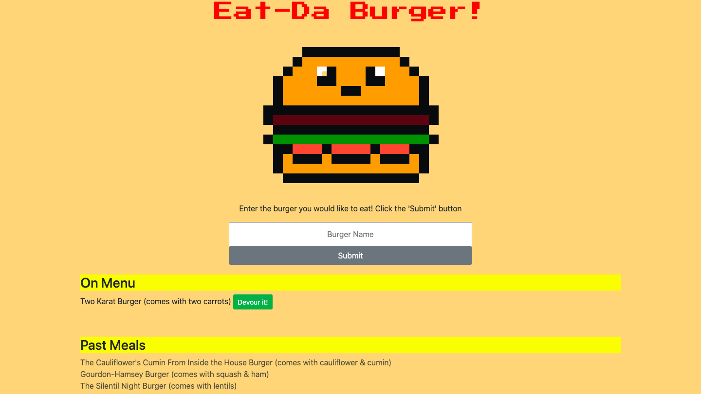

# Eat Da Burger

## Description

A web application that takes a burger from the user, then adds the burger to a waiting room waiting to be devoured. Once the user clicks on the 'Devour It!' button, the burger will be moved to a 'Past Burgers' list.

## Technologies

* JavaScript
* Node.js
* Express.js
* MySQL
* Handlebars.js

## Installation

````
npm i express express-handlebars mysql
````

## Goal of the Project

**Create a Restaurant app that lets users input the names of burgers they'd like to eat**

As a full-stack web application, I needed to follow an MVC design pattern when creating my app. Therefore, I used Node and MySQL to query and route data in the app and Handlebars to generate the HTML.

## Usage

The following image is an example of the application's appearance and functionality: 



## URL

See the deployed web application [here](https://arcane-anchorage-18876.herokuapp.com/)

## License

MIT License

Copyright (c) 2020 Dailey Kaze

Permission is hereby granted, free of charge, to any person obtaining a copy of this software and associated documentation files (the "Software"), to deal in the Software without restriction, including without limitation the rights to use, copy, modify, merge, publish, distribute, sublicense, and/or sell copies of the Software, and to permit persons to whom the Software is furnished to do so, subject to the following conditions:

The above copyright notice and this permission notice shall be included in all copies or substantial portions of the Software.

THE SOFTWARE IS PROVIDED "AS IS", WITHOUT WARRANTY OF ANY KIND, EXPRESS OR IMPLIED, INCLUDING BUT NOT LIMITED TO THE WARRANTIES OF MERCHANTABILITY, FITNESS FOR A PARTICULAR PURPOSE AND NONINFRINGEMENT. IN NO EVENT SHALL THE AUTHORS OR COPYRIGHT HOLDERS BE LIABLE FOR ANY CLAIM, DAMAGES OR OTHER LIABILITY, WHETHER IN AN ACTION OF CONTRACT, TORT OR OTHERWISE, ARISING FROM, OUT OF OR IN CONNECTION WITH THE SOFTWARE OR THE USE OR OTHER DEALINGS IN THE SOFTWARE.
